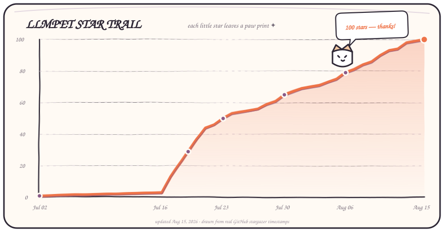

# 🐙 LLMPET — 本地多 Agent 桌面工作台

[简体中文](README.md) | [English](README_EN.md) | [日本語](README_JA.md)

<p align="center">
  <a href="https://github.com/myunwang/LLMPET/stargazers"></a>
  <a href="https://github.com/myunwang/LLMPET/forks"></a>
</p>

LLMPET 是一个**以桌宠为入口、本地优先的多 Agent 工作台**。它把 **Claude Code、OpenAI Codex 和 DeepSeek Harness** 的会话放到同一个桌面层：看状态、找会话、回到原窗口、管理历史，也能把一项工作从一个 Agent 安全地交给另一个 Agent 继续。

桌宠仍然是 LLMPET 最直观的交互方式：它会随 Agent 的状态变表情（思考 / 干活 / 等你授权 / 完成庆祝 / 睡觉），把回复弹成气泡；但产品能力已经从“看 Agent 在做什么”，扩展到**统一会话管理、跨 Agent 接管、本机归档与备份、用量诊断和可控的 Agent 行动**。Claude Code 需要授权时，还可以直接在桌宠上一键允许 / 拒绝。

> **跨 Agent 的准确边界：** Claude 与 Codex 之间不是共享一份原生 transcript。LLMPET 会在本地提取最近对话和当前 Git 工作区摘要，做密钥脱敏后生成临时交接单，再启动目标 Agent；交接单明确要求目标 Agent 重新核查文件、运行状态和失败路径。同一 Agent 内则使用官方 resume / fork。DeepSeek Harness 目前可作为交接来源，暂不作为接管目标。

## 不只是桌宠

| 能力层 | LLMPET 现在能做什么 |
|---|---|
| **桌面感知** | 用章鱼 🐙、像素怪兽 👾、月薪喵 🐱 三款皮肤呈现思考、工具执行、并行子任务、等待、完成和错误状态 |
| **统一会话层** | 汇总 Claude Code、Codex、dsh 的实时会话与本机历史；支持搜索、筛选、置顶、归档和回到原窗口 |
| **跨 Agent 接管** | Claude ↔ Codex 双向交接；dsh → Claude / Codex 单向交接；同代理使用原生 resume / fork |
| **本机档案馆** | 统一索引三类 Agent 的用户会话，过滤内部 subagent；可选增量备份，恢复时不覆盖仍存在的源文件 |
| **可控行动** | 一键处理 Claude 授权、发送表情包指令、发起只读项目旅行；所有主动任务都由用户明确触发 |
| **用量与诊断** | 展示上下文、额度窗口、真实 token 趋势、本机台账和可追溯的估算口径，不把本机数据冒充厂商账单 |

## 跨 Agent 接管怎么工作

```text
来源会话
├─ 目标是同一 Agent ──► 官方 resume；来源仍在运行时使用官方 fork
└─ 目标是另一 Agent ─► 最近对话 + Git 状态/差异摘要 + 来源标记
                         └─ 本地脱敏交接单 ──► 启动可见的目标 Agent 会话
```

- 跨 Agent 交接单只取有上限的最近对话与工作区摘要，并对常见 API Key、Bearer token、密码和私钥字段做脱敏。
- 临时目录权限为 `0700`、交接文件为 `0600`；启动成功后约两分钟自动清理，启动失败则立即清理。
- 目标 Agent 收到的是带来源说明的**交接上下文**，不是伪装成原生恢复；它会被要求保留无关改动，并区分已验证、未验证和剩余风险。
- 当前接管目标仅支持 Claude Code 与 Codex。dsh 会话可被读取并交给二者，但 LLMPET 不承诺在未安装可用 TUI profile 的机器上恢复某条 dsh 历史会话。

LLMPET 的状态机、计量、权限流、进程对账、会话归档和桌面 UI 都在本仓库实现。Claude Code 通过公开 hook 接口接入；Codex 与 DeepSeek Harness 默认只读监听各自的本机会话文件，不修改 Agent 配置。

**贡献者**

- [@james6666-max](https://github.com/james6666-max) — Windows 平台支持：「去回复」窗口聚焦、终端 pid 链解析与缓存、electron-builder 打包链路、CI Windows 测试矩阵（[PR #6](https://github.com/myunwang/LLMPET/pull/6)）。
- [@ziyuezhou1](https://github.com/ziyuezhou1) — 在独立实验分支中实现 Windows Terminal 精确标签聚焦，包括标签身份捕获、缓存恢复、高权限终端支持与验证脚本（[PR #16](https://github.com/myunwang/LLMPET/pull/16)）。
- [@purrfecto114-lgtm](https://github.com/purrfecto114-lgtm) — 提交了 CodeWhale 接入、运行时安全、持久化防护与测试体系的深度审计及改进提案（[PR #10](https://github.com/myunwang/LLMPET/pull/10)）。该 PR 未合并，但其中投入的审计与方案工作同样值得感谢。
- [@andglf](https://github.com/andglf) — 定位并修复并行子代理共享 session 时权限请求被误拒的问题，并提供了实测数据与回归测试（[PR #13](https://github.com/myunwang/LLMPET/pull/13)）。

欢迎更多 PR！

### 月薪喵皮肤 × 状态

| 表情 | 状态 | 什么时候出现 |
|:---:|:---|:---|
|     | 🛠️ **working 干活** | 正在调用工具 / 改文件——4 张打工姿态轮换：拍「上号」按钮 / 熬夜冠军 / 捂耳猛敲 / 边吃边敲 |
|   | 🤔 **thinking 思考** | 提交提问后 / 工具间隙的长推理——思考姿态轮换：挠头 / 躺想浮云 |
|  | 💬 **talking 回应中** | Claude 正在输出回复文本（对着笔记本疯狂输出喵喵喵） |
|  | 🤹 **juggling 并行子任务** | 召唤 subagent 多线开工（趴键盘上还同时刷手机） |
|  | 🧹 **sweeping 清理** | 压缩 / 清理上下文（对手机喷消毒水） |
|  | ✋ **waiting 等你授权** | 需要你点「允许 / 拒绝」（抱着手机冒冷汗） |
|  | ❓ **needsinput 等你回复** | 需要你选择 / 输入（头顶冒问号挠头） |
|  | 🔔 **attention 看一眼** | 任务刚结束提醒你（从工位起身够手机看消息） |
|  | 🎉 **happy 完成庆祝** | 一轮任务干完（摸小猫的头夸夸） |
|  | 👋 **greet 打招呼** | 新会话开始（被闹钟炸醒弹射到工位） |
|  | 💥 **error 出错** | 执行失败 / API 报错（抱头崩溃大叫） |
|    | 🍦 **loafing 摸鱼** | 上一步干完、下一步还没来的间隙——摸鱼轮换：躺地刷手机 / 点外卖 / 奶瓶手机 |
|  | 🪑 **idle 待命** | 没有任务（转椅上冰淇淋+手机摸鱼） |
|   | 😴 **sleeping 睡觉** | 会话结束 / 久无活动——睡姿轮换：被窝一坨 / 拔肚子毛当眼罩 |

---

## 工作原理

```
Claude Code ──(生命周期 hook)──► octopus-hook.js ──HTTP POST /state──┐
            ──(PermissionRequest HTTP hook，阻塞)──► /permission ──┤
                                                                   ▼
                                              ┌──────────────────────────────┐
                                              │  本地 HTTP server (127.0.0.1) │
                                              └──────────────┬───────────────┘
                                                             ▼
            会话状态机 (core) ── 适配器 ── pet:stats / pet:event ──► 桌宠/面板渲染
            计量扫描 (metering) ── 读 ~/.claude transcript → 算 token & 花费 ─┘
```

1. 安装时往 `~/.claude/settings.json` 注册两类钩子（**合并写入，不覆盖你已有的钩子**，卸载会先备份）：
   - **命令钩子**：Claude Code 在 `SessionStart / UserPromptSubmit / PreToolUse / PostToolUse / Stop / SubagentStart …` 触发 `hook/octopus-hook.js`，它读 stdin + transcript 尾巴，POST 一个状态包给本地 server（`127.0.0.1:41330` 起）。
   - **PermissionRequest HTTP 钩子（阻塞）**：需要授权时 Claude Code POST `/permission` 并挂起，等桌宠回 `allow/deny`。
2. 本地 server 把状态喂给**会话状态机**；**适配器**翻译成前端契约（`pet:stats` 快照 + `pet:event` 事件）。
3. **计量模块**增量扫描 `~/.claude/projects/**/*.jsonl`，按 `message.id` 去重统计每轮 token，乘模型单价算花费，喂详情面板。

> **「Claude 客户端消息」**指的是 Claude Code（CLI agent）的回复内容——`Stop` 时从 transcript 抽最后一段 assistant 文本（截断 + 密钥脱敏），对应桌宠的 `💬` 气泡。（不是 Claude 桌面聊天 App 的消息。）

### 🛰️ Codex 后端（零配置、只读）

除 Claude Code 外，桌宠也能盯 [OpenAI Codex](https://github.com/openai/codex)（CLI / Desktop）：

```
Codex CLI / Desktop ──写 rollout──► ~/.codex/sessions/YYYY/MM/DD/*.jsonl
                                          │ (codex-watch 增量 tail，只读)
                                          ▼
                    同一个会话状态机 (core, agentId: 'codex') ──► 桌宠/面板
```

- **不装任何钩子**：Codex 只有一个全局 `notify` 配置位（常被 ChatGPT 桌面 App 占用），所以走「监听 rollout 文件」——增量 tail、零配置、卸载无残留。
- 事件映射：`user_message→思考`；首个 `exec_command/apply_patch` 后整轮保持“干活中”（工具结果和中间 reasoning 不会误降成思考），直到 `task_complete→完成庆祝+💬` 或 `turn_aborted→中断徽标`；`token_count→上下文%`。guardian / auto-review 等 subagent 内部线程自动过滤，长会话恢复时只读取新增事件、不重放历史。
- **用量与额度分开**：按 rollout 每条 `last_token_usage` 建立去重台账，显示今日 / 本机留存历史 token；套餐 5h 主窗口与周窗口仍单独读取 `rate_limits`。本地 token 台账不冒充 OpenAI 账单或账号全生命周期统计。
- **组合形态**（托盘 → 设置 → 分身）：主宠默认同时盯 Claude、Codex 与已安装的 dsh；Codex 宠和 dsh 宠可分别开启，形象、位置、名牌与事件路由彼此独立。
- `LLMPET_NO_CODEX=1` 关闭 Codex 监听；`LLMPET_CODEX_DIR=<dir>` 指向假目录做开发验证。

### 🌊 dsh / DeepSeek Harness 后端（零配置、只读）

第三个能盯的后端是 [DeepSeek Harness](https://github.com/deepseek-ai/deepseek-harness)（CLI 名 `dsh`）。它仍处于 **developer preview**，上游明确提示会有破坏兼容的变更；LLMPET 对未知日志版本采取 fail-closed：不解析、不展示为正常会话，等待适配后再支持。

```
dsh web / dsh --profile … ──写会话日志──► ~/.dsh/sessions/--项目--/<会话>/session.jsonl.zstd
                                                │ (dsh-watch 增量 tail，只读)
                                                ▼
                        同一个会话状态机 (core, agentId: 'dsh') ──► 桌宠/面板
```

- **不装任何插件**：dsh 自带 Claude Code / Codex 两种 hook 桥接插件，但都得用户往自己的 profile 里装插件、改 `cordis.patch.yml`。为一只桌宠去改你的 agent 组合不值当——所以照 Codex 的路子读它自己的会话日志，零配置、卸载无残留。
- **压缩日志也读得动**：dsh 的日志默认是 **zstd 分帧**（`session.jsonl.zstd`，一次落盘一帧），而 Electron 33 自带的 Node 20 没有 zstd API。桌宠自己扫帧边界、逐帧解压（内置纯 JS 解码器 [fzstd](https://github.com/101arrowz/fzstd)，MIT，见 `backend/vendor/`），末尾半帧留到下一轮。单个压缩帧有 32 MiB 的解码安全上限；超过时会记录并跳过该帧、继续后续日志，避免监听永久卡死。`compression: 'none'` 的纯文本 `session.jsonl` 同样支持。
- 事件映射：`turn/start→思考`；首个 `tool/call` 之后整轮保持“干活中”；`turn/end completed→完成庆祝 + 💬`，`aborted/blocked→中断徽标`，`error→出错`；`approval/asked→等你回复`（授权仍在 dsh 自己的界面里答）；`compaction→打扫`；`session/title` 直接用它自己起的标题；`assistant/message.usage` 配 `request/context.contextWindow` 算上下文 %。`origin: 'subagent'` 与 `delegationDepth > 0` 的子 agent 线程整份跳过。
- 运行时面板会把 `dsh web`、`--profile headless`、已安装的 `--profile tui`，以及 Node / `npx @deepseek-ai/dsh` 入口识别为 dsh agent。`dsh web` 是内置的通用 Web profile（默认 `http://127.0.0.1:3080`，改过端口用 `LLMPET_DSH_WEB` 覆盖），不是某一条历史会话的精确定位；会话列表的「去回复」只能打开这个通用入口，不能承诺跳回具体 session。TUI 可用 `dsh --profile tui --resume <id>` 恢复，但该 profile 需要本机先安装；只有 web / headless profile 的机器不能把 dsh 作为 LLMPET 接管目标。dsh 会话仍可作为**来源**交接给 Claude / Codex（生成本地交接单）。
- **不做用量 / 计费**：dsh 可接任意模型供应商，本地日志没有可信的单价口径，所以只报上下文 %；**不会显示推测的价格、成本或账单**。
- `LLMPET_NO_DSH=1` 关闭 dsh 监听；`LLMPET_DSH_DIR=<dir>` 指向假目录做开发验证；日志根目录跟随 `$DSH_HOME`（默认 `~/.dsh`）。

---

## 下载安装包（Releases）

Windows 安装包与 zip 在 [Releases](../../releases) 页随每个 `v*` tag 自动发布。

**macOS 未签名版说明**：当仓库未配置 Apple 签名 secrets 时，macOS 包为 adhoc 未签名构建（文件名带 `-unsigned`）。首次打开需**右键→打开**，或执行：

```bash
xattr -cr /Applications/LLMPET.app
```

配置 `APPLE_DEVELOPER_ID_P12_BASE64` 等 secrets 后，流水线自动切换为签名+公证构建。

---

## 从源码安装与运行

完整的源码部署、调试、权限与本地打包说明见 [《部署到用户本地》](docs/LOCAL_DEPLOYMENT.md)。

> **升级兼容说明：** `~/.octopus`、`OCTOPUS_*` 环境变量和 `octopus-hook.js` 是早期版本留下的内部兼容标识，为避免丢失配置、用量历史、辅助功能授权或已安装 hooks，1.0.0 继续保留；产品名称和所有对外发布物统一使用 **LLMPET**。

**前置条件**
- macOS 或 Windows（状态显示、授权气泡、计量计费、「去回复」终端聚焦全都可用；「领地模式」目前仅 macOS）
- Node.js ≥ 18（含 npm）
- 至少安装并使用过一个受支持的 agent：[Claude Code](https://claude.com/claude-code) 或 [OpenAI Codex](https://github.com/openai/codex)

```bash
git clone https://github.com/myunwang/LLMPET.git
cd LLMPET
npm ci               # 按 package-lock.json 安装（国内网络慢可加：ELECTRON_MIRROR=https://npmmirror.com/mirrors/electron/ npm ci）
npm start            # 启动桌宠（首次启动会注册 Claude Code 钩子）
```

启动后新开的 Claude Code / Codex / DeepSeek Harness 会话会被感知；近期仍活跃的 Codex rollout 与支持版本的 dsh 日志也会静默恢复到会话列表。右键桌宠可切三款皮肤，并分别开关 Codex / dsh 分身。

**Windows 说明**
- 命令与上面相同（PowerShell 下设镜像用 `$env:ELECTRON_MIRROR='https://npmmirror.com/mirrors/electron/'` 再 `npm ci`）。
- 钩子在 Windows 下经 PowerShell 运行；「去回复」通过 user32 把会话所在的终端窗口（Windows Terminal / cmd / VS Code 等）带到前台，Windows Terminal 多标签场景只能聚焦到窗口级别。
- 终端归属解析（pid 链）首次约 1–2s（起一次 PowerShell），之后按会话缓存在 `~/.octopus/pidwalk-cache.json`，热路径无感。
- 打包安装版：`npm run package:win`（electron-builder，产出 NSIS 安装包 + zip；国内网络可另设 `$env:ELECTRON_BUILDER_BINARIES_MIRROR='https://npmmirror.com/mirrors/electron-builder-binaries/'`）。

- 首次启动会把钩子写进 `~/.claude/settings.json`（合并、可逆）。之后新开的 `claude` 会话即被桌宠感知。
- **左键点桌宠** = 弹出**会话列表**（状态 + 会话名 + 上下文用量%）；可搜索、按 Claude / Codex / 待处理筛选、置顶或归档，点某行把对应终端 / 客户端调到前台。偏好写入 `~/.octopus/config.json`。
- 会话面板底部的 **📚 档案** = 打开独立的**会话档案馆**，统一查看 Claude Code / Codex / dsh 在客户端、CLI 或 Harness 日志中留下的全部用户会话（子代理会话会被过滤），并可使用已支持 provider 的官方 resume，或生成本地交接单交给另一个代理接管。macOS 上 LLMPET 会保留一个 Dock 入口，点击即可重新显示或聚焦档案馆，不会创建第二个实例。
- 档案馆的**定期本机备份默认关闭**。用户主动开启后，会增量备份 Claude、Codex 与 DSH 会话到 `~/.octopus/session-vault`；恢复只补回已经丢失的 transcript，绝不覆盖仍存在的源文件。它能应对 provider 重装或记录被删，但不是云同步，也不能防止整块硬盘损坏。
- **右键** = 泡泡菜单；**拖动** = 移动位置。等授权/等回复时会**自动**弹允许/拒绝气泡。
- 托盘菜单可开详情面板、静音、唤起 Claude、打开日志、**卸载钩子**、退出。
- 详情面板里可切皮肤 / 模式 / 设 5h 预算。

### 开发 / 验证开关
- `OCTOPUS_NO_HOOKS=1 npm start` —— 启动但**不动** `~/.claude/settings.json`（只验证主进程 / 界面）。
- `OCTOPUS_ALLOW_MULTI=1 npm start` —— 跳过多实例防护（默认：实例锁 + 启动探测到别的 LLMPET 实例就退出 + 存活期间守护 `runtime.json` 不被其他副本抢走）。
- `OCTOPUS_NO_NET=1 npm start` —— **完全离线**：关掉唯一的外联请求（每 24h 拉一次 [LiteLLM 公开价目表](https://github.com/BerriAI/litellm)，只下载、不上传任何本地数据），花费改用内置估算单价。
- `OCTOPUS_DEBUG=1 npm start` —— 开放 `GET /debug`（默认关闭，会暴露会话 cwd / 标题等，仅本机回环可访问）。
- `npm test` —— 无头端到端冒烟测试（hook→server→core→adapter、权限持开→decide 字节级响应）。
- 日志：`~/.octopus/octopus.log`。

### 界面语言（简体中文 / English / 日本語）
托盘「⚙️ 设置 → 🌐 语言 / Language」即时切换，无需重启：托盘、桌宠气泡、会话列表、详情面板和表情包文案同时跟着变，选择存在 `~/.octopus/config.json` 的 `lang`（默认 `zh`）。

英日版**不是逐字翻译**——桌宠的语气建立在中文梗上，直译过去梗就没了。所以每种语言取的是**功能对等的本地梗**，比如「你这瓜保熟吗？」（华强买瓜，逼你验货别糊弄）在英文里是 *"Source: trust me bro?"*，日文里是「それってあなたの感想ですよね？」。表情包下发给 Claude / Codex 的 Prompt 也跟着切语言，英文界面不会突然甩一段中文进会话。

> 表情包的 GIF 素材本身带中文字幕（如月薪喵皮肤的「熬夜冠军」），换语言不会改图 —— 那要重做素材。

### 计量 / 计费
- Claude 数据源：本机 `~/.claude/projects/**/*.jsonl`；Codex 数据源：本机 `~/.codex/sessions/**/*.jsonl`。计量只提取 token、模型、时间与单次 usage，均为增量只读扫描。
- 状态分别持久化到 `~/.octopus/usage.json` 与 `~/.octopus/codex-usage.json`。Claude 首次回填近 95 天；Codex 显示本机仍保留的 rollout 历史，不等同于账号账单。
- **流式用量按最终快照结算**：同一 `message.id` 出现多条增长记录时，对每类 token 取累计最大值，只追加正增量，避免第一条输出不完整或跨轮询重复计数。
- **缓存 TTL 分账**：Claude 的 5 分钟 cache write、1 小时 cache write 与 cache read 分开统计和计价，不再把 1h 写入套用 5m 单价。
- **按完整 model id 精确计价与上下文窗口**：从 [LiteLLM 公开价目表](https://github.com/BerriAI/litellm) 同步单价和 context window；未同步模型明确落到家族估算。可用 `~/.octopus/pricing.json` 覆盖（家族键或精确 `models` 映射）：
  ```json
  { "opus": {"input":15,"output":75,"cacheWrite5m":18.75,"cacheWrite1h":30,"cacheRead":1.5},
    "models": { "claude-fable-5": {"input":10,"output":50,"cacheWrite5m":12.5,"cacheWrite1h":20,"cacheRead":1,"contextWindow":1000000} } }
  ```
  （单位：美元 / 百万 token。）
- 面板中的 Claude 金额是**按 API 公价折算的本地估算**，不是 Claude 订阅账单；可切换 token / 金额趋势，并显示扫描时间、估算模型、价格表新鲜度和流式修正数等诊断。
- **重算历史**：改了定价、或想用最新价目纠正过去存错价的历史，跑 `npm run meter:rebuild`（从 transcript 真相源重扫重算、写回 `usage.json`；`--no-sync` 用现有缓存价、`OCTOPUS_NO_NET=1` 完全离线）。

### 卸载钩子
托盘「🧹 卸载 Claude 钩子」，或：
```bash
npm run uninstall:hooks
```

---

## 目录结构

```
main.js                 Electron 主进程：窗口 / IPC / 托盘 / 启动编排
preload.js              前后端唯一接口（contextBridge）
renderer/  assets/      桌宠 + 面板的视觉与渲染
hook/
  octopus-hook.js        Claude Code 触发的钩子脚本（读 stdin/transcript，POST /state）
backend/
  transport.js          端口发现 / runtime 文件 / 标识头 / 钩子→server 传输 / node 定位
  transcript.js         transcript 解析（assistant 文本 / 上下文用量 / API 错误 / 标题）
  pidwalk.js            进程树解析（定位会话所在终端）
  hookinstall.js        merge-safe 钩子安装器（合并不覆盖 / 原子写 / 卸载备份）
  launch.js             开终端跑 claude
  core.js               会话存储 + 状态机 + 快照 + 陈旧清理
  dsh-watch.js          DeepSeek Harness 会话日志监听（只读 tail，agentId: 'dsh'）
  zstd.js               zstd 分帧扫描 + 逐帧解压（原生优先，回落 vendor/fzstd）
  vendor/fzstd.js       内置纯 JS zstd 解码器（MIT，见同目录 LICENSE-fzstd）
  server.js             本地 HTTP server（/state /permission /health）
  permission.js         授权持开/决策（字节级 CC 响应）
  adapter.js            内部模型 → 前端契约（事件 + 统计 + choice）
  metering.js           计量 + 计费（transcript 扫描 + 定价 + 持久化）
  hooks.js              钩子生命周期（安装 + settings 监视器）
  focus.js              定位会话（mac 优先）
  config.js  log.js     配置持久化 / 日志
shared/
  states.js             状态词表单一来源（主进程 / 渲染端 / 测试共用）
  i18n.js               全部界面文案的单一来源（zh / en / ja，主进程与渲染端共用）
test/smoke.js           端到端冒烟测试
test/i18n.js            文案完整性（三语键位对齐 / 占位符 / 梗真的本地化了）
test/dsh-watch.js       dsh 会话日志监听（事件映射 / 子 agent 过滤 / zstd 增量）
test/zstd.js            zstd 分帧读取（完整帧 / 半帧 / 坏数据）
```

---

## 风险与权衡（已知）

| 项 | 说明 | 现状 / 缓解 |
|---|---|---|
| **本地写入接口** | `/state` 与 `/permission` 接收 Claude hook 数据 | 仅绑 `127.0.0.1`，并要求每次启动随机生成的令牌；令牌只存在于权限为 `0600` 的 runtime 文件和当前 Permission hook URL |
| **钩子残留** | 退出后钩子仍在，Claude Code 每个事件会 spawn 一次钩子（连不上 server，100ms 超时） | 影响极小；托盘可一键卸载 |
| **定价与账单差异** | LiteLLM 公价或内置回退价可能晚于厂商变化；订阅套餐也不按 API 公价结算 | 面板明确标为 API 公价折算；显示价格表时间 / 估算模型，可覆盖价格并重算 |
| **读 transcript** | 读取本机 `~/.claude` 下的会话记录 | 仅本地、仅 token 计数，不外传、不读正文 |
| **focusSession** | 「去回复」在 macOS / Windows 生效 | Linux 需原生 helper，暂未实现；Windows 上 SetForegroundWindow 受系统前台锁限制，辅以 SwitchToThisWindow 兜底 |
| **本地历史边界** | 删除 / 截断 transcript 或 rollout 后，本地台账无法代表账号完整历史 | 诊断区显示扫描状态；Claude 可从现存 transcript 重建，Codex 明确标为“本机留存历史” |

### 安全加固（已做）
- HTTP 仅 `127.0.0.1` + loopback / Host / Origin 校验 + 每次启动随机令牌；body 上限（state 16KB / permission 1MB）；全字段规范化校验。
- 配置 / 用量 / settings 全部**原子写**；钩子安装**合并不覆盖**、卸载先备份；settings 被外部清空时自动重注册。
- Electron：`contextIsolation` 开、`nodeIntegration` 关、拦截外部导航与 `window.open`。
- assistant 文本截断 + 控制字符清洗；命令行密钥样式标题脱敏（钩子内置）。

---

## 未做 / 后续
- 其它 agent（Gemini / Copilot…）尚未适配；当前支持 Claude Code 与 OpenAI Codex。
- Linux 的会话定位（Windows 已支持）、Windows 领地模式、远程审批、自动更新：本项目暂未实现。

---

## ⭐ Star 轨迹

<p align="center">
  <a href="https://github.com/myunwang/LLMPET/stargazers">
    
  </a>
</p>
